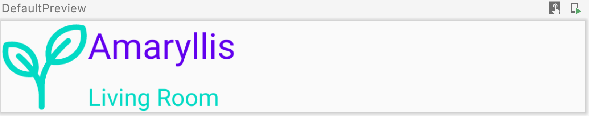
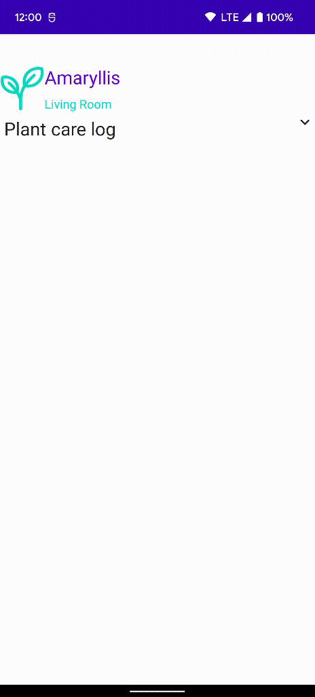
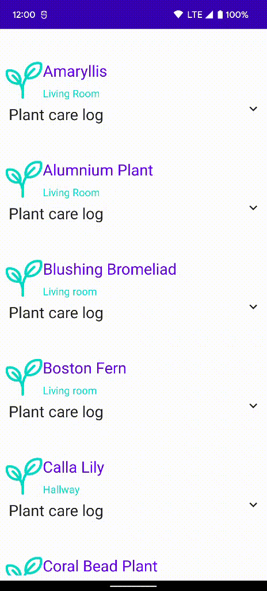

***Welcome to the "Compose Yourself!" AppDevCon Workshop***

Here you can find the answers to the questions and tasks posed in the [README.md] file

Explore the generated code for the Empty Compose Activity and try to answer the following
questions:<br />
**1. (1m) How is the Activity's content set?**<br />
**Answer**: Calling setContent same as before, but using i.s.o calling upon a layout XML or creating
instances of UI widgets we call upon a function.

**2. (3m) What can you highlight about the `Greeting` function?**<br />
**Answer:**

- It has a `@Composable` annotation.
- Does not return a value.
- Function takes in data: accepts a `String` that's part of the text being shown.
- Calling this function results in the text being displayed in the UI.

_What does it really mean?_

The Compose compiler learns that this function intends to convert data into UI via the `@Composable`
annotation. When the composable functions are executed the compiler will build the UI for us.<br />
**Composition** = description of the UI built by the Compose compiler when it executes composables.
Composition is a _tree-structure_ of the composables that describe your UI.

**3. (5m) Can you explain what happens when the code runs? How is the text label updated?** <br />
**Answer:**
When the button from `ClickCounter` is clicked the `onClick` event is handled by the
lambda `onClick` passed as a parameter. In the lambda the `clickCounter` value is incremented.
Because the `clickCounter` type is of `MutableState` (more about it in part 2), the compose compiler
calls the `ClickCounter` composable anew with the new value for `clicks`.

This process of re-running the composables in order to update the Composition when data changes is
called **recomposition**.

Once the UI has been built by the Compose compiler there is no way to modify the `Text` label. The
UI is immutable, it cannot be modified or even queried. The only way to update the label is to call
the `ClickCounter` composable function anew with the new value for `clicks`.

**4. (3m) Change the code so that it shows 2 texts in a line, one after another, or in a stack, one
below the other. What can you tell about the `content` parameter?** <br />

```
Column {
    Text(text = "Hello",
        modifier = Modifier.align(Alignment.Start)
    )
    Text(text = "$name!",
        modifier = Modifier.align(Alignment.End)
    )
}
Row {
    Text(text = "Hello",
        modifier = Modifier.align(Alignment.Top))
    Text(text = "$name!",
        modifier = Modifier.align(Alignment.Bottom))
}
```

For a `Row` the type is `content: @Composable RowScope.() -> Unit` while for `Column` the type
is `content: @Composable ColumnScope.() -> Unit`

*Compose enforces type safety by means of custom scopes*: The child content passed inside a `Row`
can only use modifiers that are supported by the `Row` composable.

**5. (4m) What are the elements that make up the generated theme? How do you apply a color or
typography from the theme? How can you customize it?** <br />
**A:** Core components of any Material theme are: colors, typography and shapes. By the way
the `Part01Theme` is defined it will be able to easily switch between dark and light mode.

```
MaterialTheme(
        colors = colors,
        typography = Typography,
        shapes = Shapes,
        content = content
    )
```

#### Material theme

Material theme properties are easily available by directly calling `MaterialTheme.colors.primary`
or `MaterialTheme.typography.h5`. For customizing you can use the `LocalX` which
are `CompositionLocal`
types that reflect the style/color/typography/etc. at the call site:

```
Text(text = plant.name, style = MaterialTheme.typography.h5)

Surface(color = MaterialTheme.colors.background)
 
//or customizing the current style by creating a copy and modifying the required values.
Text(text = plant.name, style = LocalTextStyle.current.color.copy(alpha = 0.8f))
```

Find more composable elements fully supporting material theming in the Material Catalog App:

* [Material Catalog App](https://play.google.com/store/apps/details?id=androidx.compose.material.catalog "Material Catalog App")<br />
* [Source code](https://cs.android.com/androidx/platform/frameworks/support/+/androidx-main:compose/integration-tests/material-catalog/ "Material Catalog")<br />

The `@Preview` annotation will generate a preview of your composable without having to run the
application. You can apply multiple `@Preview` annotations to the same function and you can use
different parameters for each annotation to generate different styles/modes for the same composable.
Example:use `uiMode = Configuration.UI_MODE_NIGHT_NO` for dark mode.

**6.Make changes to the code to build the `PlantCard` that will be shown in the inventory
list.** <br />
**Answer:**
Start by first creating the following 
The plant name and location are contained in a column. Then the image and the column are added to a
row:

```
Row(modifier = Modifier.fillMaxWidth()) {
    Image(
        painter = painterResource(id = R.drawable.ic_plant_default),
        //contentDescription is a mandatory parameter, cannot be omitted.
        contentDescription = "",
    )
    Column(modifier = Modifier.fillMaxWidth()) {
        Text(
            text = plant.name,
        )
        Text(
            text = plant.location,
        )
    }

```

Use `colorFilter = ColorFilter.tint(MaterialTheme.colors.secondary, BlendMode.SrcIn)` on the image
to add a tint to it. Use `modifier = Modifier.align` with the correct arguments for the scope to
correctly align the elements. For the text style and color use the properties
mentioned [earlier](#material-theme).

**7. Add the expandable area in the card so that the care log can be shown. Bonus: Animate the
expansion.** <br />
**Answer:**

Start of by building the content statically then add the click to expand and animation. In order to
show the arrow down, you can use the predefined material vector drawable icons from `Icons.Filled`
namely `KeyboardArrowDown` and `KeyboardArrowUp`. In order to add all the care log entries use a
loop for `plant.careLog`, like so:

```
for (care in plant.careLog) {
    Text(
        text = "${care.date}: ${care.description}",
    )
}
```

To allow expanding/collapsing we need to tell the Compose compiler that a state has change so
recomposition can be scheduled. For this you rely again on `mutableStateOf` to provide you a state
that Compose can observe. You can declare the `isExpanded` variable with:
`var isExpanded by remember { mutableStateOf(false) }`
We have to change the icon at the end of the "Plant care log" label:

```
val icon = if (isExpanded) {
    Icons.Filled.KeyboardArrowUp
} else {
    Icons.Filled.KeyboardArrowDown
}
```

Make sure that the entire row of "Plant care log" is clickable (i.e. label *and* the icon). To make
it clickable you use `Modifier.clickable` and in its `onClick` pass the lambda that toggles the
expanded state variable
`Row(modifier = Modifier.clickable(onClick = { isExpanded = !isExpanded })) {`

In order to create the background you have to use material shapes which are added via `Surface`
composable.

```
Surface(
        shape = MaterialTheme.shapes.medium,
        color = MaterialTheme.colors.primary,
    )
```

In order to create animations, you can

* use `Modifier.animateContentSize()` to animate the size changes
* or use any of the `animate[Value]AsState` to animate a specific value transitioning (including
  size).

**8. Create a list to show the plant inventory** <br />
**Answer:**
Create a new composable that uses a `LazyColumn` to show the plant inventory. The list items will
only be created when they have to be shown on screen. The lazy lists (columns, row & grids) have
their own DSL that allows for ease of use:

```
@Composable
fun PlantOverview(inventory: List<Plant>) =
    LazyColumn {
        items(inventory) { plant ->
            PlantCard(plant)
        }
    }
```

Check the [completed] module for the finished solution.