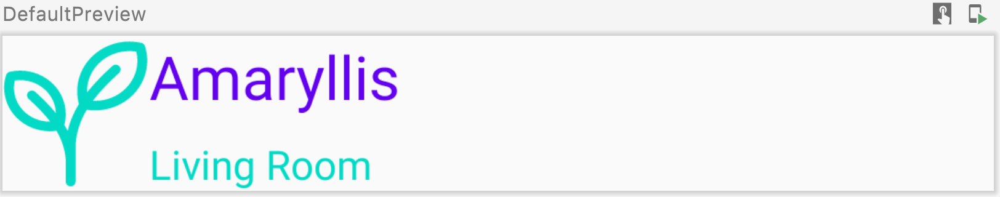
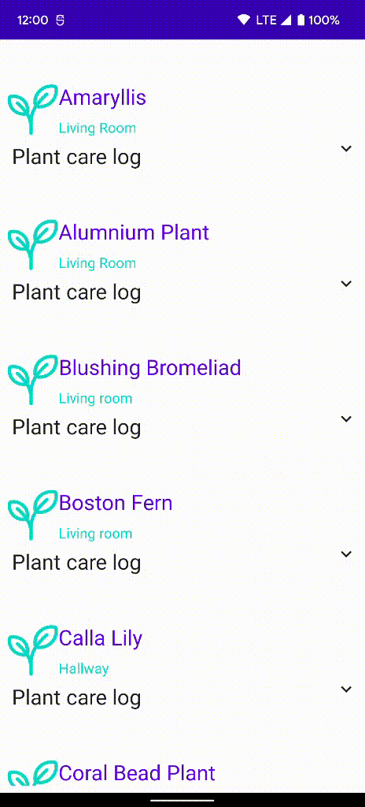

***Welcome to the "Compose Yourself!" AppDevCon Workshop***

What you need:

- [Android Studio Chipmunk](https://developer.android.com/studio/)
- Working knowledge of Kotlin [idioms](https://developer.android.com/jetpack/compose/kotlin) like
  high order functions, scopes & receivers, etc.

## Part 1

After completing part 1 of the workshop you should be able to:

- Use composable functions to describe a Compose UI
- Define what composition & recomposition are
- List the ways recomposition execution impacts your Compose code

Explore the generated code for the Empty Compose Activity and try to answer the questions below. If
you want help, you can find the answers [here](ANSWERS.md).

1. **Q:** How is the Activity's content set?
2. **Q:** What can you highlight about the `Greeting` function?
3. **Q:** Can you explain what happens when you make the following changes and run the code? How is
   the text label updated?

```
@Composable
fun ClickCounter(clicks: Int, onClick: () -> Unit) {
    Button(onClick = onClick) {
        Text(text = "I've been clicked $clicks")
    }
}
```

And replace `Surface` call in the activity with:

```
Surface(modifier = Modifier.fillMaxSize(), color = MaterialTheme.colors.background) {
    var clickCounter by remember { mutableStateOf(0) }
    ClickCounter(clicks = clickCounter, onClick = {
        clickCounter++
    })
}
```

### Note:

> The line `var clickCounter by remember { mutableStateOf(0) }` creates a `MutableState<Int>` variable
> by using Kotlin's delegated property. The `State`/`MutableState` types are the state types you have
> to use so that the Compose compiler is able to monitor and react to state changes. This will be
> covered in more detail in [Part02](../Part02/README.md). For now you can think of them as special
> state types that make it possible for the Compose compiler to work it's magic. <br />
> Learn more about delegated
> properties [here](https://developer.android.com/jetpack/compose/kotlin#delegated)

4. **Q:** Change the code so that it shows 2 texts in a line, one after another, or in a stack, one
   below the other. What can you tell about the `content` parameter?
5. **Q:** What are the elements that make up the generated theme? How do you apply a color or
   typography from the theme? How can you customize it? Explore the `@Preview` annotation.
6. **Q:** Make changes to the code to build the `PlantCard` that will be shown in the inventory
   list: <br /><br />
7. **Q:** Add the expandable area in the card so that the care log can be shown. Bonus: Try to see
   if you can create an animation for expanding the area<br />

<details>
  <summary>Expandable plant card animation:</summary>

<br />
</details>

8. **Q:** Create a list to show the full plant inventory:<br />

<details>
  <summary>Plants overview screen:</summary>

 <br />
</details>


Resources & further reading:

1. [Thinking in Compose](https://developer.android.com/jetpack/compose/mental-model)
2. [Managing state](https://developer.android.com/jetpack/compose/state)
3. [Lifecycle compose](https://developer.android.com/jetpack/compose/lifecycle)
4. [Compose Pathway](https://developer.android.com/courses/pathways/compose)