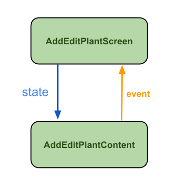

***Welcome to the "Compose Yourself!" AppDevCon Workshop***

Here you can find the answers to the questions and tasks posed in the [README.md](README.md) file

**1. Explore the additions done to the code base on top of the Part 1**

- A new Material 3 [Theme](begin/src/main/java/org/green/thumb/ui/theme/Theme.kt) was added
- New dependencies and the [NavGraph](begin/src/main/java/org/green/thumb/NavGraph.kt) were added
- The `PlantOverview` and `PlantCard` were moved to their own package.
- The `PlantOverview` now includes a material  `Scaffold` with a `FAB`.

In order to start using Materia 3 Theming some extra changes are required. *Change imports to use
Material 3 for: `Text`, `MaterialTheme`, `Surface` and `Icon`.*

Replaced usages of:

- `MaterialTheme.colors` with `MaterialTheme.colorScheme`
- `MaterialTheme.typography.h5` with `MaterialTheme.typography.titleLarge`
- `MaterialTheme.typography.body1` with `MaterialTheme.typography.bodyMedium`

Removed the `Surface` call from the content in `MainActivity` and changed the app's generated theme
definition in XML with:

```
<style name="Theme.GreenThumbOverview" parent="@android:style/Theme.Material.Light.NoActionBar">
    <item name="android:statusBarColor">@android:color/transparent</item>
    <item name="android:navigationBarColor">@android:color/transparent</item>
    <item name="android:windowLightNavigationBar" tools:targetApi="o_mr1">true</item>
</style>
```

For navigation: the `NavController` is still the central API for navigation. Its state is saved by
using `rememberNavController`. The navigation graph is defined in Kotlin DLS inside the `NavHost`.
In Compose the path to your composable is uniquely identified by a `String` called **route**

> **NB:**
> You can reuse the Navigation component you have defined for fragments in Compose, but not the
> other way around: a Navigation component defined in Compose can only work with composable
> destinations. Read about navigation interoperability [here](https://developer.android.com/jetpack/compose/navigation#interoperability)

**2. Add the `onClick` for the `FAB` in `PlantOverview` so that it will open the new empty
screen**<br />
**Answer**:
Navigating in Compose is done by calling `navController.navigate()` and passing the unique route for
the destination you want to reach. In order to keep the passed parameters to the minimum required
you can pass in a lambda that navigates to the correct destination: `onAddPlant: () -> Unit`:

```
composable(PlantOverviewRoute) {
    PlantOverview(SampleData.plantInventory) { navController.navigate(AddPlantRoute) }
}
```

while the call site in the `NavHost` becomes

```
fun PlantOverview(inventory: List<Plant>, onAddPlant: () -> Unit) =
    Scaffold(floatingActionButton = {
        FloatingActionButton(onClick = onAddPlant) {
            Icon(Icons.Filled.Add, stringResource(id = R.string.add_plant))
        }
    }
```

**3. Implement the plant input form so that it can accept user input (handle only input for now,
save & navigation will be done later). Explain what happens when you try to change the text in the
name input field in `AddEditPlantContent`. Why is the field not updating? How can it be
updated?**<br />
**Answer:**<br />

When running the current code in `AddEditPlantContent` the text input field does not change. This is
because text field *does not update its state by itself* (Composable widgets are stateless, as
opposed to an [EditText](https://developer.android.com/reference/android/widget/EditText)):

* The text field will only change when its `value` parameter changes
* The current value is hardcoded to an empty string: `value = ""`.

In order to update the `OutlinedTextField` you have to **pass in a value** that represents the state
of the field and update the state when the text field **notifies you of the change**.

How can this be done? Using a local String variable (`var inputText = ""`) will not work. It does
not work because Compose *does not know what has changed and has no means to track these changes*.
This is where the special state type mentioned in part 1 comes in: by using the
types [State](https://developer.android.com/reference/kotlin/androidx/compose/runtime/State)
or [MutableState](https://developer.android.com/reference/kotlin/androidx/compose/runtime/MutableState)
you can tell compose what it needs to keep track of.

```
interface State<T : Any?>

A value holder where reads to the value property during the execution of a Composable function, the current RecomposeScope will be subscribed to changes of that value.
```

<details>
  <summary>Definitions reminder: </summary>

> *Reminder:* <br />
> **Composition:** the UI built by the Compose compiler when it executes composable functions. <br />
> **Initial composition:** creation of a Composition by running composables the first time. <br />
> **Recomposition:** re-running composables to update the Composition when data changes. <br />
</details>

Compose has a special state tracking system in place that schedules recompositions for any
composables that read a particular state. This lets Compose be granular and just recompose those
composable functions that need to change, not the whole UI. This is done by tracking not only "
writes" (that is, state changes), but also "reads" to the state.

By using the types `State`/`MutableState` you can make state observable for Compose. Compose keeps
track of each composable that reads `State` value properties and triggers a recomposition when its
value changes.

In order to work with the trackable state, you can use `mutableStateOf()` to initialize one as
follows:

```
val test = mutableStateOf("")
OutlinedTextField(
    value = test.value,
    onValueChange = { test.value = it },
    isError = false,
    singleLine = true,
    label = {
        Text(
            text = stringResource(R.string.addedit_plant_name),
        )
    }
)
```

###### State converters

<details>
  <summary>There are functions available for converting common observable types into State&lt;T&gt; </summary>

> - For [LiveData](https://developer.android.com/reference/kotlin/androidx/compose/runtime/livedata/package-summary) you can use `observeAsState`
> - For [Flow](https://developer.android.com/reference/kotlin/androidx/compose/runtime/package-summary#(kotlinx.coroutines.flow.StateFlow).collectAsState(kotlin.coroutines.CoroutineContext)) there is `collectAsState`
> - For [Rx2](https://developer.android.com/reference/kotlin/androidx/compose/runtime/rxjava2/package-summary) there is `subscribeAsState`
</details>


However, even this code does not work. Recomposition works, but every time it runs, the text is
reinitialized to an empty string. To make it work you need a way to preserve this text value across
recompositions. To reuse the input text value it has to become part of the composition, i.e. you
need to **store** the textInput in the composition. You can do this by using the inline
function `remember`:<br />
`val textInput = remember { mutableStateOf("") }` <br />
By using `remember` the state will be part of the composition and will be reused when the function
recomposes.
> **Rule:** State created in composables needs to be remembered.
>

###### remember vs rememberSaveable

Next to `remember` there is also `rememberSaveable` which works the same way as `remember`, but the
stored value will survive the activity and process re-creation. You should use `rememberSaveable`
for storing UI state (i.e. user input, error state, etc), while the `remember` function should be
used for transient state (i.e. animation state).

###### Storing state works with `Bundle`

<details>
  <summary>Ways to restore state</summary>

All types that can go in a `Bundle` will automatically work for the `remember` functions. If you
have custom types that need to be stored, the options are:

- [@Parcelize](https://developer.android.com/jetpack/compose/state#parcelize)

```
@Parcelize
data class Plant(
    val name: String = "",
    val location: String = "",
    val wateringFrequency: Int = 0,
    val careLog: List<PlantCare> = emptyList(),
) : Parcelable
```

- [MapSaver](https://developer.android.com/jetpack/compose/state#mapsaver)

```
data class PlantCare(val description: String, val date: LocalDate)
val PlantCareSaver = run {
    val descriptionKey = "description"
    val dateKey = "date"
    mapSaver(
        save = { mapOf(descriptionKey to it.description, dateKey to it.date) },
        restore = { PlantCare(it[descriptionKey] as String, it[dateKey] as LocalDate) }
    )
}
@Composable
fun PlantCareCard() {
    var careLog = rememberSaveable(stateSaver = PlantCareSaver) {
        mutableStateOf(PlantCare("Watered", LocalDate.of(2022, 1, 16)))
    }
}
```

- [ListSaver](https://developer.android.com/jetpack/compose/state#listsaver)

```
data class PlantCare(val description: String, val date: LocalDate)
val PlantCareSaver = listSaver<PlantCare, Any>(
    save = { listOf(it.description, it.date) },
    restore = { PlantCare(it[0] as String, it[1] as LocalDate) }
)

@Composable
fun PlantCareCard() {
    var careLog = rememberSaveable(stateSaver = PlantCareSaver) {
        mutableStateOf(PlantCare("Watered", LocalDate.of(2022, 1, 16)))
    }
}
```

</details>

So now you have a way of declaring the state that is observable by Compose and is reused during
recomposition. In order to react to the text field value changes you need handle the change in
the `onValueChange`. The full code will become:

```
val inputText = rememberSaveable { mutableStateOf("") }
OutlinedTextField(
    value = inputText.value,
    onValueChange = { inputText.value = it },
    isError = false,
    singleLine = true,
    label = {
        Text(
            text = stringResource(R.string.addedit_plant_name),
        )
    }
)
```

It is safe to make changes to the state in the `onValueChange` (or any callback triggered by user
input or interaction: `onClick`, `onValueChange`, `onCheck`, etc) because the callback itself is not
a composable function. In fact, it comes with the guarantee that the callbacks are always executed
on the main UI thread. Denote that the parameter name for the event handler is in the present tense
because you have to handle the interaction **as it happens** and update the state accordingly.
> **Rule:** You should only mutate state outside the scope of a composable function, (i.e. in
> callbacks or using the [Side Effects API](https://developer.android.com/jetpack/compose/side-effects)) <br />
> This is because:<br />
> *Reminder:* Composable functions may run very often and can be executed in any order.

###### State API and property delegation

<details>
  <summary>The State API supports property delegation</summary>

The following ways of declaring a mutable state are equivalent:

```
val mutableState = remember { mutableStateOf(default) }
var value by remember { mutableStateOf(default) }
val (value, setValue) = remember { mutableStateOf(default) }
```

Use the one that works best for you.
</details> 

In order to implement the watering frequency dropdown selection, use the already
defined [DropDownField](begin/src/main/java/org/green/thumb/addedit/DropDownField.kt). To disable
the `Save` button while the name is invalid you can use the property `enabled`. Once you are able to
handle form input your code should be similar to the composable function in
[AddEditPlantContentStateful](begin/src/main/java/org/green/thumb/addedit/qa3/StatefullComposable.kt)

**4: Make the required changes to `AddEditPlantContent` so that it becomes a stateless
composable.**<br />
**Answer** <br />
The resulting `AddEditPlantContent` contains a lot of internal state making it a **stateful**
composable. This makes it difficult to test and reuse. (i.e. you cannot use the same composable to
open and edit an existing plant card.) A **stateless** composable is a composable that doesn't own
any state (it doesn't hold or define or modify new state).

You can achieve a stateless composable through **state hoisting**: a pattern that moves the state to
the caller of the composable.

In practice this means that the state T is replaced by the two parameters:

* `value: T` an input parameter that represents the current value to display
* `onValueChange: (T)->Unit` a function to represent the event that requests the value to change,
  where the T is the new value.

More specific event handlers may be required/desirable, like the `onExpand`/`onCollapse` used for
the plant card or the `validateName` in the form.

In the case of the plant location, the parameter change is

```
location: String,
onLocationChange: (String) -> Unit,
```

> **Rule** Use the unidirectional data flow pattern: Composables should receive state as parameters and communicate events up using lambdas. <br />
>  <br />
> **~~Rule~~ Guidelines:**<br />
> * **Goldilocks zone**: don't move the state higher or lower than you need it for either reading/writing.
> * **Birds of a feather stick together**: If two states change in response to the same event they should be hoisted together.
    >

* Code smells to look out for: unused parameters, too long parameter list.

> * Don't pass the state to where it's not needed
    >

* Your composables can have other composables as parameters

> * *Use previews*: having previews for your composable is a good [litmus test](https://en.wikipedia.org/wiki/Litmus#Uses) for whether your function is self-contained.

The `AddEditPlantContent` needs to take the following parameters to become stateless

```
@Composable
fun AddEditPlantContent(
    name: String,
    onNameChange: (String) -> Unit,
    validateName: () -> Unit,
    location: String,
    onLocationChange: (String) -> Unit,
    isError: Boolean,
    onWateringFrequencySelect: (Int, String) -> Unit,
    currentChoice: String,
    onClick: () -> Unit,
    modifier: Modifier = Modifier,
)
```

After you are finished hoisting the state and are correctly handling passing the events back your
code should look similarly to the code
in [AddEditPlantScreenStateless](begin/src/main/java/org/green/thumb/addedit/qa4/StatelessComposable.kt) <br />

**5: Use a plain state holder to handle name validation and navigating back after saving the plant
form.**<br />
**Answer** <br />
Often times the state used in composable can grow and the UI logic required grows with it. To solve
this you can extract both the state and the UI logic into a plain class. However, you still have to
ensure that this object not recreated with every recomposition. To do this you can use `remember`.
You can find the working solution
in [PlainStateHolder](begin/src/main/java/org/green/thumb/addedit/qa5/PlainStateHolder.kt) <br />

**6: Refactor the `PlantOverview` so that it uses the `PlantOverviewViewModel` and can show the 3
states for the content: loading, error and the list overview.** <br />
**Answer** <br />
Apply the same 