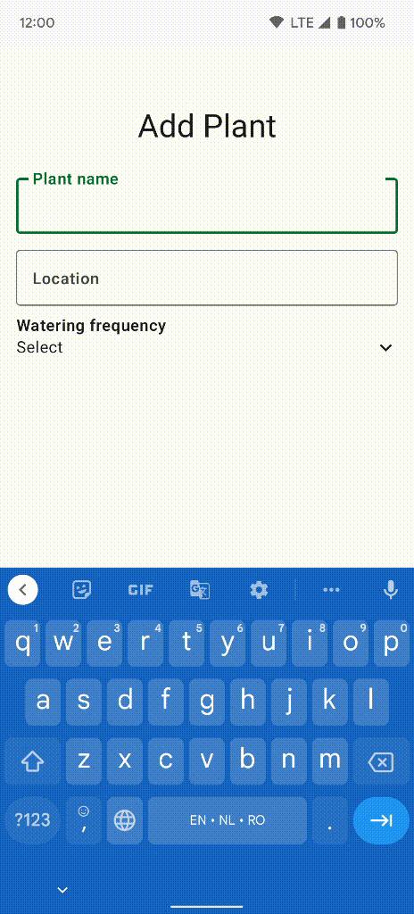

***Welcome to the "Compose Yourself!" AppDevCon Workshop***

What you need:

- [Android Studio Chipmunk](https://developer.android.com/studio/)
- Working knowledge of Kotlin [idioms](https://developer.android.com/jetpack/compose/kotlin) like
  high order functions, scopes & receivers, etc.

## Part 2

After completing part 2 of the workshop you should be able to:

- Use Material 3 Theming and navigation
- Manage state in your composable functions
- Define state hoisting and unidirectional data flow

1. **Q:** Explore the additions done to the code base on top of the Part
   1 [complete](../Part01/README.md) code base.
2. **Q:** Add the `onClick` for the `FAB` in `PlantOverview` so that it will open the new empty
   screen.

The next questions are aimed to help you build the *Add Plant* screen with the accompanying
functionality step by step: 

  
Plant input form screen: 

 

* The screen includes 2 text input fields with keyboard navigation support (actions next & done)
* Empty name for the plant is not allowed: text shows an error and save operation is not allowed.
* Watering frequency is selected via a dropdown list.
* Once save is finished the screen closes and the app navigates back to the overview list.

3. **Q:** Implement the plant input form so that it can accept user input (handle only input for
   now, save & navigation will be done later). Explain what happens when you try to change the text
   in the name input field in `AddEditPlantContent`. Why is the field not updating? How can it be
   updated?
4. **Q:** Make the required changes to `AddEditPlantContent` so that it becomes a stateless
   composable.
5. **Q:** Use a plain state holder to handle name validation and navigating back after saving the
   plant form.
6. **Q:** Refactor the `PlantOverview` so that it uses the `PlantOverviewViewModel` and can show the
   3 states for the content: loading, error and the list overview.

Resources & further reading:

1. [Theming in Compose](https://developer.android.com/jetpack/compose/themes)
2. [Managing State](https://developer.android.com/jetpack/compose/state)
3. [Navigating in Compose](https://developer.android.com/jetpack/compose/navigation)
4. [Side Effects](https://developer.android.com/jetpack/compose/side-effects)