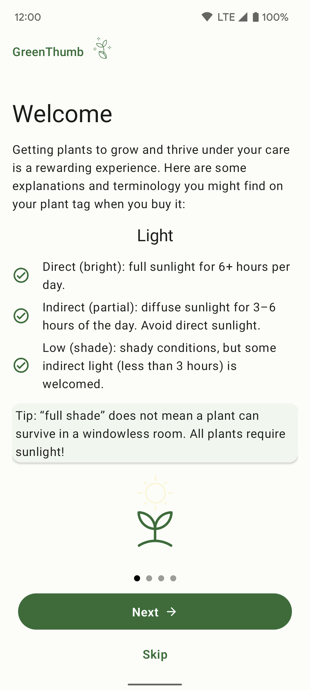

***Welcome to the "Compose Yourself!" AppDevCon Workshop***

What you need:
- [Android Studio Chipmunk](https://developer.android.com/studio/)

## GreenThumb app
This is a sample application with the UI written in Compose. It also makes use of 
- [Hilt](https://developer.android.com/training/dependency-injection/hilt-android)
- [ViewModels](hhttps://developer.android.com/topic/libraries/architecture/viewmodel)
- [Room](https://developer.android.com/training/data-storage/room/)
- [Navigation](https://developer.android.com/jetpack/compose/navigation)

The app allows creating an inventory of the plants you have, their description and location. 
For each plant a series of care actions can be performed: watering, prunning, repotting, etc.
When such an action is performed it can be saved as an entry log with its corresponding date. 
The goal being to allow an overview of all plants and their care logs (last day it was watered, 
given fertilizer, etc...)

## Part 1
The goal of this exercise is to write a part of a screen using `@Composable` functions. In the process you will:
  - familiarize yourself with Compose APIs 
  - write reusable `@Composable` functions
  - create previews for them

Write the content for the first page of the PagerItem: 

Ensure that:
- *Light* is centered and has a different style
- The itemized list is created via a reusable `@Composable` function
- The *Tip* section is highlighted
- `@Preview` for the page for both light & dark mode
Bonus: Create an animation for the image

